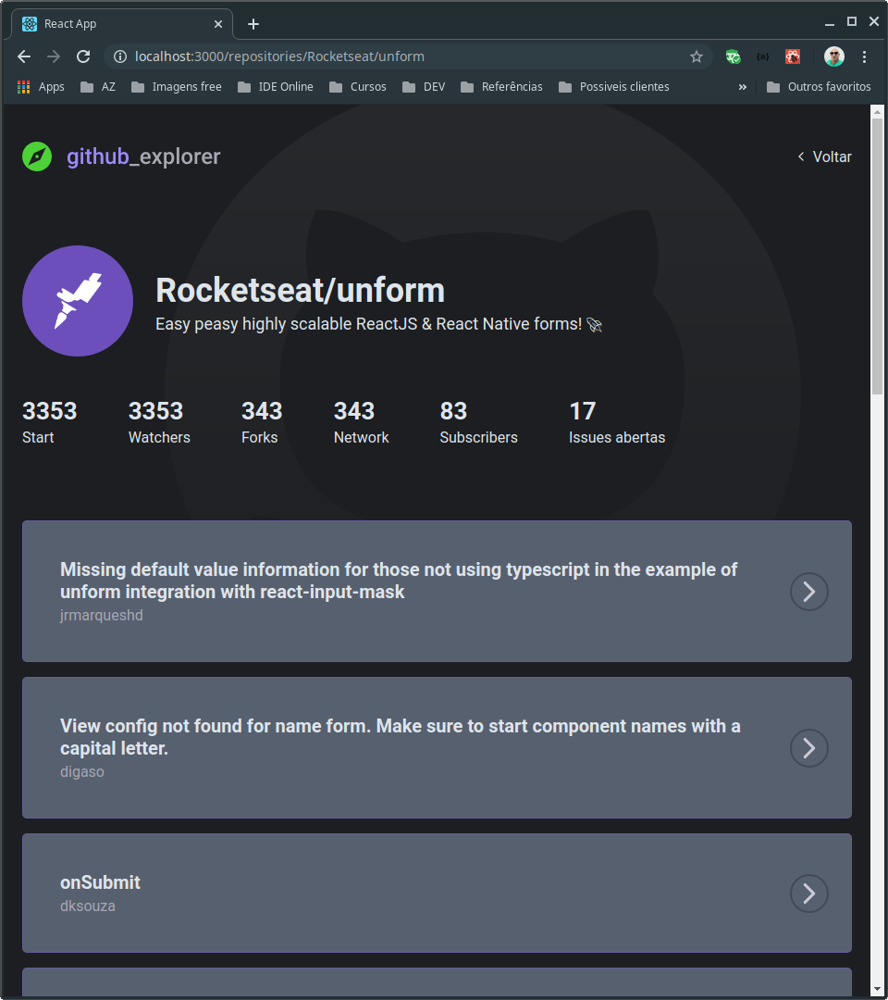

# Explore repositórios no Github
Neste projeto podemos cadastrar uma infinidade de repositórios do github, listá-los na página home e podemos acessar mais detalhes de cada projeto cadastrados.

- A base utilizada para guardar as informações cadastradas, é o localStorage do próprio navegador Google chrome (funcional também no Mozilla Firefox).

## Página inicial


## Informações do Repositório


## Sobre projeto
Projeto desenvolvido no Nível 03 em <strong>Primeiro projeto com React</strong>.
Nesta etapa foi dado início ao aprendizado do React.JS, criando o primeiro projeto já utilizando TypeScript. Nesse ponto o dev já conhecemos os conceitos de componente, estado e propriedades.

## Dependências do projeto

- Dependências que acompanham o projeto
```js
"dependencies": {
    "@testing-library/jest-dom": "^4.2.4",
    "@testing-library/react": "^9.3.2",
    "@testing-library/user-event": "^7.1.2",
    "@types/jest": "^24.0.0",
    "@types/node": "^12.0.0",
    "@types/react": "^16.9.0",
    "@types/react-dom": "^16.9.0",
    "axios": "^0.19.2",
    "polished": "^3.6.3",
    "react": "^16.13.1",
    "react-dom": "^16.13.1",
    "react-icons": "^3.10.0",
    "react-loading": "^2.0.3",
    "react-router-dom": "^5.2.0",
    "react-scripts": "3.4.1",
    "styled-components": "^5.1.0",
    "typescript": "~3.7.2"
  },

  ```
- Dependências de desenvolvimento
```js
"devDependencies": {
    "@types/react-router-dom": "^5.1.5",
    "@types/styled-components": "^5.1.0",
    "@typescript-eslint/eslint-plugin": "^2.33.0",
    "@typescript-eslint/parser": "^2.33.0",
    "eslint": "^6.6.0",
    "eslint-config-airbnb": "^18.1.0",
    "eslint-config-prettier": "^6.11.0",
    "eslint-import-resolver-typescript": "^2.0.0",
    "eslint-loader": "^4.0.2",
    "eslint-plugin-import": "^2.20.1",
    "eslint-plugin-jsx-a11y": "^6.2.3",
    "eslint-plugin-prettier": "^3.1.3",
    "eslint-plugin-react": "^7.19.0",
    "eslint-plugin-react-hooks": "^2.5.0",
    "prettier": "^2.0.5"
  }
```

## Configurações específicas para este projeto

- .eslintigonore (forçar o Eslint ignorar arquivos e pastas alistados)
```js
**/*.js
node_modules
build
```
- .eslintrc.json
Esta configuração extende as funcionalidades para verificação de erros no código com base em padrões populares
```json
"extends": [
        "plugin:react/recommended",
        "airbnb",
        "plugin:@typescript-eslint/recommended",
        "prettier/@typescript-eslint",
        "plugin:prettier/recommended"
    ],
```

Abaixo seguem regras para ignorar padrões e erros para o código que desenvolvemos
```json
"rules": {
      "react-hooks/rules-of-hooks": "error",
      "react/jsx-one-expression-per-line": "off",
      "react-hooks/exhaustive-deps": "warn",
      "react/jsx-filename-extension": [1, {"extensions": [".tsx"]}],
      "import/prefer-default-export": "off",
      "no-console": "off",
      "@typescript-eslint/explicit-function-return-type": [
        "error",
        {
          "allowExpressions": true
        }
      ],
      "import/extensions": [
        "error",
        "ignorePackages",
        {
          "ts": "never",
          "tsx": "never"
        }
      ]
    },
    "settings": {
      "import/resolver": {
        "typescript": {}
      }
    }
  ```

- .editorconfig
Este arquivo define um padrão de compatibilidade com IDEs de desenvolvimento mais conhecidas. Evitando que o código fique desorganizado de um editor para outro.
```json
root = true

[*]
indent_style = space
indent_size = 2
charset = utf-8
trim_trailing_whitespace = true
insert_final_newline = true
end_of_line = lf
```

- prettier.config.js
  As configurações neste arquivo são responsáveis pela formatação correta do código
```js
module.exports = {
  singleQuote: true,
  trailingComma: 'all',
  arrowParens: 'avoid',
  bracketSpacing: true,
  jsxBracketSameLine: false,
};
```


## Bibliotecas utilidades
- [axios](https://github.com/axios/axios)
- [polished](https://github.com/styled-components/polished)
- [react-dom](https://pt-br.reactjs.org/docs/react-dom.html)
- [react-icons](https://react-icons.github.io/react-icons/)
- [react-loading](https://github.com/fakiolinho/react-loading) { usa apenas para teste, pois está desatualizada }
- [react-router-dom](https://github.com/ReactTraining/react-router)
- [styled-components](https://styled-components.com/)


## Como baixar e executar o projeto
Para baixar e executar o projeto, use os comandos abaixo (exemplo):
```zh
cd ~
git@github.com:andrelinos/05-primeiro-projeto-react.git
cd 05-primeiro-projeto-react
yarn
```
Para executar o projeto, execute:
```zh
yarn start
```
- O projeto será aberto em seu navegador padrão na seguinte url: `http://localhost:3000/`

## Como editar o projeto
- Abra seu editor de código padrão
- Clique em File > Open Folder... (exemplo)
- Selecione a pata `05-primeiro-projeto-react` que você acabou de baixar
- Altere os arquivos  que estão dentro da pasta `src` conforme desejar

**Nota**:
- Os arquivos `styles.ts` são responsáveis pelo estilo de cada respectiva página.

